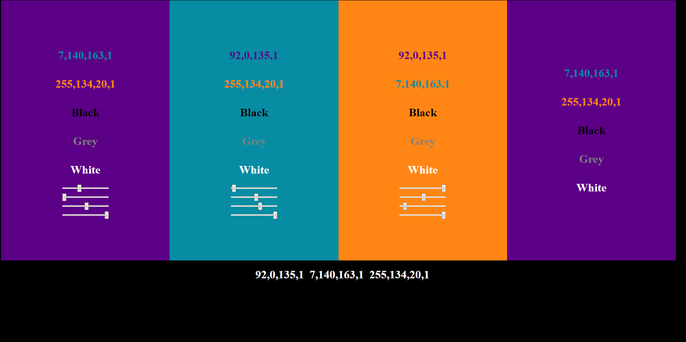

# RGBA-ColorSlider
Use sliders to modify the RGBA Text Color or Background Color of HTML Elements. Useful for theme design.
Created by Jon Spencer

VERSION HISTORY:
V1.0 2020-05-21 Initial Creation

OVERVIEW:
The purpose of this tool is to allow for dynamically adjusting colors on a Web-Page in real time. The initial use case of this was to be able to easily compare and tweak potential color combinations. Multiple instances of the tool can be used together to allow any number of elements to be independently adjusted. Likewise, each set of sliders can be adjust a separate Text Color and Background Color class simultaneously. The numerical RGBA values can optionally be displayed on screen for reference purposes.

Naturally, each of sliders in a set will control the "R", "G", "B" or "A" value (in that order) for the CSS class. 

IMPORTANT NOTE: The sliders manually override the values of the affected target elements, they do not actually update the CSS Classes directly. As such, I don’t recommend linking the sliders to CSS classes which have other uses. Additionally, the targeted CSS classes doesn't actually need to exist in the stylesheet/inline styling; they just need to be assigned to the intended target HTML element(s).

USE:
The bulk of the script defines the custom "RGBASlider" JavaScript class. The Class must be instantiated with a few parameters and then initiated. That process will inserts a functioning set of sliders into the target HTML element and no other back end work is required.

FILES:
	-- colorSlider.js					: This includes the JavaScript for the RGBASlider() class. 
										Externaly Reference the file using   
										or copy the contents directly into an inline  Element.
  
	-- colorSliderExamplePage.html		: This is an example HTML page which externally references the main colorSlider.js file

CONSTRUCTOR:
	RGBASlider(parent, opts);
	
		example 1:
			new RGBASlider( document.getElementById("foo"), {
				backgroundClass: "bar",
				outputTarget: document.getElementById("oof"),
				textClass: "baz",
				presets:[ 123, 45, 67, 89 ]
			});
		
		example 2: 
			const myOpts={
						backgroundClass: "bar",
						outputClass: "bat",
						textClass: "baz",
						presets:[ 98, 67, 54, 32 ]
					}
			new RGBASlider( document.getElementById("foo"), myOpts ).init();

CONTRUCTOR-ARGUMENTS:	
	parent  - (Required) < Type: an HTML Element > 
	This parameter identifies the HTML element to which the sliders will be appended upon instantiation.
	
		example 1: document.getElementById('foo');
		example 2: document.body;
		
	opts	- (Optional*) < Type: Object >  
	This parameter includes several optional attributes, which are described further below: {backgroundClass,textClass,outputClass,outputTarget,presets}
		* If no options are passed, the sliders won't actually do anything (other than slide).
		
		example 1:
			{
				backgroundClass: "bar",
				outputClass: "bat",
				outputTarget: document.getElementById("foo"),
				textClass: "baz",
				presets:[ 123, 45, 67, 0.89 ]
			}
			
	opts{attributes} - <Type: "key":"value" Pairs >:
	
	opts.backgroundClass - (Optional) < Type: STRING > This parameter contains the name** of a CSS class. All HTML elements belong to that Class will have their Background colors changed when any of the Sliders in the set are adjusted.  
		* Do not include a period at the begining of the CSS Class Name!

			example: { backgroundClass: "bar" }
	
	opts.outputClass - (Optional) < Type: STRING > 
	This parameter contains the name** of a CSS class. All HTML elements belong to that Class will have their .innerText attribute updated to reflect the calculated RGBA numbers when any of the Sliders in the set are adjusted. 
		* Do not include a period at the beginning of the CSS Class Name!
		NOTE: This was included for use-cases wherein displaying the RBGA numbers in multiple places would be helpful. It this option is used, it is generally advisable to assign it to the same CSS class as the textClass attribute so that the output appears in it's corresponding color for the sake of clarity.

			example: { backgroundClass: "bat" }
			
	opts.outputTarget - (Optional) < Type: an HTML Element > This parameter identifies the HTML element which have its .innerText attribute updated to reflect the calculated RGBA numbers when any of the Sliders in the set are adjusted. 
		NOTE: This was included for use-cases wherein the RBGA numbers only need to be displayed in 1 place.
		
			example: {   outputTarget: document.getElementById("foo") }
			
	opts.presets - (Optional) < Type: Array > This parameter takes in an an Array of numbers which will be used as the starting RGBA values* for the Instance. Upon initiation, the slider bars will be set to the coresponding positions and any of the optional {backgroundClass,textClass,outputClass,outputTarget} arguments will also be updated accordingly. Elements[0-2] of the Array accept a range of 0-255, Element[3] accepts a range of 0-100*. If no presets are specified, a default value of [0,0,0,100] will be used.
		* Even though, the A number in an RGBA value is actually accepts 0.00 - 1.00, the slider has a range of 0-100 to represent a percentage input. The Class's internal calculations automatically divide that slider's value by 100 to get the correct formatting.
	
		example: presets:[ 123, 45, 67, 0.89 ]
	
CONTRUCTOR-INSTANCE METHODS:

	.init(); 
	
	- Initializes an instance of the Class after it's instantiation. The initialization event creates the slider HTML <input> Elements and append them to the instance's parent element. These sliders are sets reflect the RGBA numbers from the opts.preset argument or the default values. The initialization also adds an event listener to each of the sliders which calculates the new RBGA values when any of the sliders are moved and updates the CSS Classes and Output text according to the Instances options. Finally the functions which the event listener calls upon is triggered once so that the CSS Colors and Output text match the Instance's stored color value even before the sliders are ever used. 
	
			example: new RGBASlider( foo, bar ).init();
